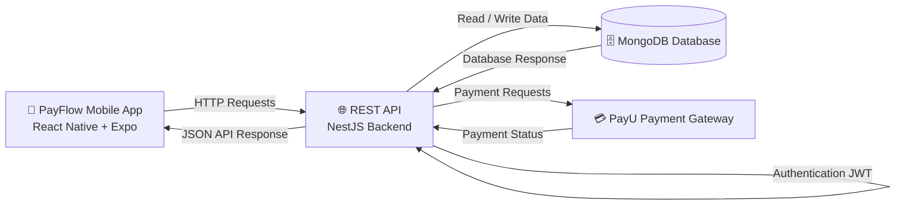

# 💳 PayFlow Backend API

Backend API for the **PayFlow** application built with **NestJS** and **TypeScript**.

This backend provides authentication, payment transactions, messaging, currency exchange services and integration with PayU payment gateway.

---

# 🚀 Tech Stack


Framework:
- NestJS
Language:
- TypeScript
Architecture:
- Modular architecture
- REST API

---

# 🏗 System Architecture



---

# 📦 Features

### 🔐 Authentication
- User registration
- User login
- JWT authentication
- Protected API routes

### 👤 User Management
- Update user profile
- Manage user data

### 💸 Transactions
- Create transactions
- Transaction history
- Payment processing

### 💳 PayU Integration
- Payment gateway integration
- Payment status handling

### 💱 Currency Service
- Currency exchange rates
- Currency conversions

### 💬 Messaging System
- Send messages between users
- Store and retrieve messages

---

# 📂 Project Structure

```
src
│
├── auth
│   ├── auth.controller.ts
│   ├── auth.service.ts
│   ├── auth.module.ts
│   ├── jwt.strategy.ts
│   └── dto
│       ├── login.dto.ts
│       └── register.dto.ts
│
├── users
│   ├── users.controller.ts
│   ├── users.service.ts
│   ├── users.module.ts
│   ├── schemas
│   │   └── user.schema.ts
│   └── dto
│       └── update-user.dto.ts
│
├── transactions
│   ├── transactions.controller.ts
│   ├── transactions.service.ts
│   ├── transactions.module.ts
│   └── schemas
│       └── transaction.schema.ts
│
├── payu
│   ├── payu.service.ts
│   └── payu.module.ts
│
├── currency
│   ├── currency.controller.ts
│   ├── currency.service.ts
│   └── currency.module.ts
│
├── messages
│   ├── messages.controller.ts
│   ├── messages.service.ts
│   ├── messages.module.ts
│   └── schemas
│       └── message.schema.ts
│
├── common
│   ├── guards
│   │   └── jwt-auth.guard.ts
│   └── pipes
│       └── validation.pipe.ts
│
├── database
│   └── database.module.ts
│
└── main.ts
```

---

# ⚙️ Installation

Clone the repository:

```bash
git clone https://github.com/Dmytro-Potapchuk/backend-pay-flow.git
```

Navigate to project folder:

```bash
cd backend-pay-flow
```

Install dependencies:

```bash
npm install
```

---

# ▶️ Running the Server

Start development server:

```bash
npm run start:dev
```

Production mode:

```bash
npm run start:prod
```

Server runs on:

```
http://localhost:3000
```

---

# 🔐 Authentication

Protected routes use **JWT tokens**.

Example header:

```
Authorization: Bearer <token>
```

---

# 🔗 Related Repository

Frontend application:

https://github.com/Dmytro-Potapchuk/PayFlow

---

# 📸 API Example

Example login request:

```
POST /auth/login
```

Body:

```json
{
  "email": "user@email.com",
  "password": "password123"
}
```

Response:

```json
{
  "access_token": "JWT_TOKEN"
}
```

---

# 👨‍💻 Author

Dmytro Potapchuk

GitHub  
https://github.com/Dmytro-Potapchuk

---

# 📄 License

MIT
